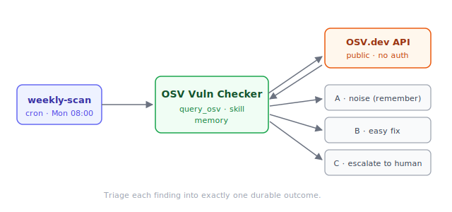

# OSV Vulnerability Checker

An example ArchAstro **Solution** bundle — a deployable agent that scans
your dependencies against [OSV.dev](https://osv.dev) on a schedule and
triages what it finds. Copy this directory and tailor it to build your own.



## What's in here

```
osv-vuln-checker/
  sample.yaml                 # deploy steps + bundle version
  solution.yaml               # catalog wrapper: templates list, tags, readme
  agents/
    osv-vuln-checker.yaml      # the deployable AgentTemplate (no agent_key)
    osv-vuln-checker.md        # its Library-inspector body
  tools/
    query-osv.yaml             # AgentToolTemplate (display_name required)
    query-osv.md
  routines/
    weekly-scan.yaml           # AgentRoutineTemplate (cron)
    weekly-scan.md
  skills/
    osv-triage-playbook/
      SKILL.md                 # an instruction skill the agent uses
  scripts/
    query-osv.aascript         # the query_osv tool implementation
    verify-osv-reachable.aascript  # a setup verifier
  diagrams/architecture.svg
  env.example
```

This one bundle demonstrates every building block: **scripts**, a **skill**,
a custom **tool**, a cron **routine**, and **setup actions** (an env var and
a script-backed verifier).

## Work on it

From the repo root:

```sh
archagent validate solution solutions/osv-vuln-checker   # schema + script check
archagent lint     solution solutions/osv-vuln-checker --strict
archagent package  solution solutions/osv-vuln-checker   # build the .tar.gz
```

## Deploy it

```sh
archagent package solution solutions/osv-vuln-checker
archagent import  solution ./osv-vuln-checker-v0.1.0.tar.gz
```

See the repo root `README.md` and `AGENTS.md` for the full authoring guide.
